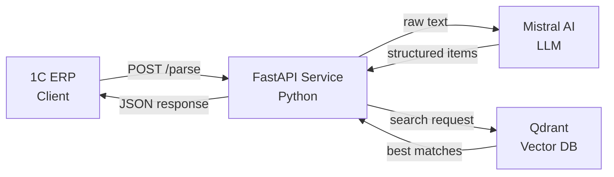
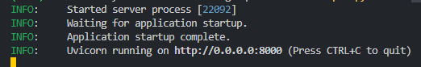
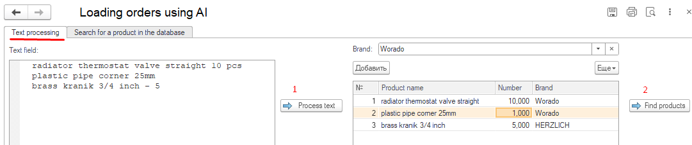
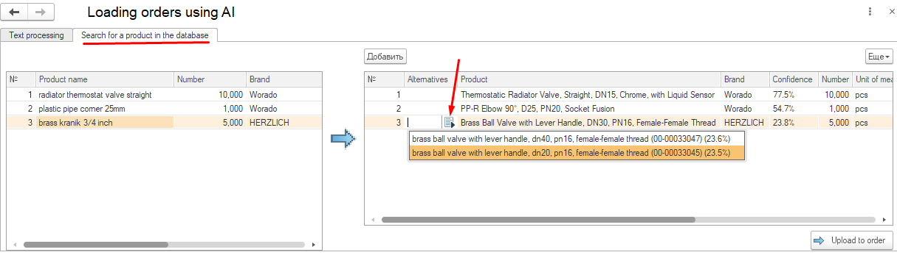
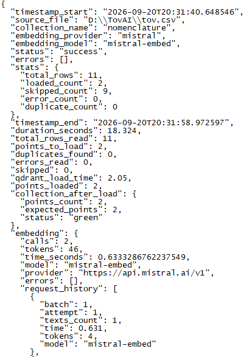

# Order Parser AI

An AI-powered system for parsing unstructured customer orders and matching them against a product catalog using semantic search.

## 🎯 Problem

Sales managers receive customer orders in various formats (handwritten notes, Excel, PDF, images) with product names that only partially match the company's product database. Manual order processing is slow and error-prone.

## 💡 Solution

This project provides an end-to-end pipeline that:

1. **Parses** raw order text using an LLM (Mistral AI)
2. **Extracts** structured product items (name + quantity)
3. **Matches** each item against the product catalog using vector similarity search
4. **Returns** the best matches with confidence scores

## 🏗️ Architecture
```
┌─────────────┐       ┌──────────────┐     ┌─────────────┐
│ 1C ERP      │────▶ │ FastAPI      │────▶│ Mistral AI  │
│ (Client)    │◀──── │ Service      │◀────│ (LLM +      │
└─────────────┘       │ (Python)     │     │ Embeddings) │
                      └──────┬───────┘     └─────────────┘
                             │
                             ▼
                       ┌─────────────┐
                       │ Qdrant      │
                       │ (Vector DB) │
                       └─────────────┘

```




> **Flow:**
> 1. **1C ERP** sends raw order text to the `/parse` endpoint
> 2. **FastAPI Service** forwards the text to **Mistral AI** (LLM)
> 3. Mistral returns structured product items (name + quantity)
> 4. The service searches for each item in **Qdrant** (vector database)
> 5. Qdrant returns the best matches with confidence scores
> 6. The service returns the final result to 1C ERP                       

## 📸 Screenshots

### Service Startup

The FastAPI service starts and listens for incoming requests from 1C ERP:



### Parsing an Order (LLM)

The `/parse` endpoint receives raw order text and returns structured items in ERP:



### Product Search (Vector DB)

The `/search` endpoint matches parsed items against the product catalog in ERP:



### Statistics & Logging

Each request is logged with detailed statistics (tokens, time, calls):




### Components

- **1C ERP** — sends raw order text to the service
- **FastAPI Service** — orchestrates parsing and search
- **Mistral AI** — LLM for parsing, embeddings for semantic search
- **Qdrant** — vector database for product catalog

## ✨ Key Features

- **Hybrid ranking** — combines semantic similarity with numeric/keyword matching
- **Multi-language support** — handles Ukrainian and Russian product names
- **Duplicate handling** — automatically resolves duplicate product codes
- **Smart filtering** — searches within a specific brand if provided
- **Full statistics** — tracks tokens, time, and API calls per request
- **Comprehensive logging** — saves every request/response to JSON logs

## 🛠️ Tech Stack

- **Python 3.12** — core language
- **FastAPI** — REST API framework
- **Qdrant** — vector database
- **Mistral AI** — LLM and embeddings
- **PyInstaller** — for building standalone executables
- **NSSM** — for running as a Windows service

## 📦 Installation

### Prerequisites

- Python 3.10+
- Qdrant (running locally or remotely)
- Mistral AI API key

### Setup

1. Clone the repository:
git clone https://github.com/VitaliiVarshko/order-parser-ai.git
cd order-parser-ai


2. Create a virtual environment:
python -m venv venv
venv\Scripts\activate  # Windows
source venv/bin/activate  # Linux/macOS

3. Install dependencies:
pip install -r requirements.txt

4. Configure the project:
copy .env.example .env
Edit .env with your API keys and paths

5. Load products into Qdrant:
python load_to_qdrant.py

6. Start the API service:
python http_service.py

### 🚀 Usage
## Parse order
bash
POST /parse
Content-Type: application/json

{
  "text": "Кран шаровой 3/4\" - 3 шт\nПрофіль 30х20 - 40м",
  "user": "Johns Does"
}
# Response:

json
[
  {
    "original": "Кран шаровой 3/4\" - 3 шт",
    "name": "Кран шаровой 3/4\"",
    "qty": "3"
  },
  {
    "original": "Профіль 30х20 - 40м",
    "name": "Профіль 30х20",
    "qty": "40"
  }
]
# Search products
bash
POST /search
Content-Type: application/json

{
  "items": [
    {"original": "Кран шаровой 3/4\"", "name": "Кран шаровой 3/4\"", "qty": "3"}
  ],
  "mark": "Walravens",
  "user": "Johns Does"
}
# Response:

json
[
  {
    "original": "Кран шаровой 3/4\"",
    "name": "Кран шаровой 3/4\"",
    "qty": "3",
    "best_match": {
      "code": "00-00777753",
      "name": "Профіль монтажний 30х20мм 3м",
      "mark": "Walravens",
      "confidence": "98.4%"
    },
    "alternatives": []
  }
]
### 📊 How It Works
## 1. Parsing (LLM)
The raw order text is sent to Mistral AI with a prompt that instructs it to extract structured items. The LLM returns a JSON array with product names and quantities.

## 2. Embedding
Each product name is converted to a vector using mistral-embed. Vectors are stored in Qdrant for fast similarity search.

## 3. Hybrid Ranking
When searching, the system combines:

Semantic similarity (from Qdrant) — up to 10%

Keyword matching — up to 50% (proportional to matched keywords)

Numeric matching — up to 40% (proportional to matched numbers)

This ensures that products with matching sizes, models, or brands rank higher than just semantically similar ones.

## 4. Filtering
If a brand is specified, the search is limited to products of that brand. Otherwise, it searches only products with an empty brand field.

### 📈 Statistics
The service collects detailed statistics for every request:

LLM calls and tokens

Embedding calls and tokens

Total execution time

Number of items parsed and matched

### 🔐 Security
API keys are stored in config.py (not committed to Git)

Sensitive data is excluded via .gitignore

All requests are logged for audit

### 📝 License
MIT License — see LICENSE for details.

### 👤 Author
Vitalii Varshko

GitHub: @VitaliiVarshko

### 🙏 Acknowledgments
Mistral AI for LLM and embedding APIs

Qdrant for vector search

FastAPI for the web framework